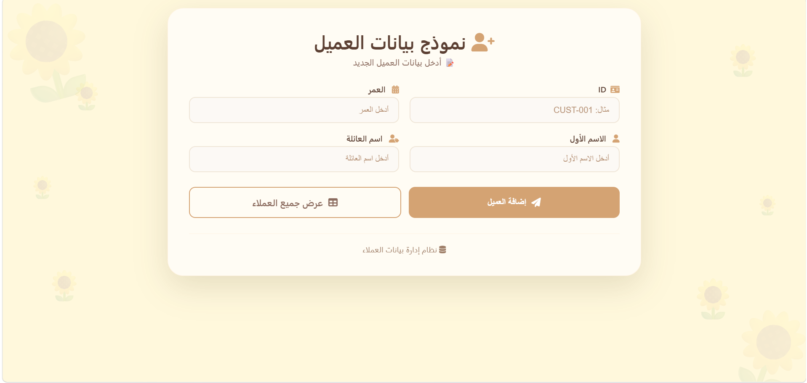

# Customer Management System

A Customer Management System developed using HTML, CSS, and JavaScript to manage customer information through a clean and user-friendly interface.

The project focuses on practicing front-end development concepts such as form validation, DOM manipulation, dynamic data rendering, and responsive UI design.

---

# Project Overview

This project allows users to:

- Add new customer records.
- Validate user input before saving.
- Prevent duplicate customer IDs.
- Display success and error messages.
- View all registered customers.
- Toggle customer status between Active and Inactive.
- Display customer statistics.
- Provide a responsive and modern interface.

---

# Technologies Used

- HTML5
- CSS3
- JavaScript (ES6)

---

# Features

- Responsive RTL interface.
- Customer ID validation.
- Duplicate customer detection.
- Dynamic customer table.
- Active / Inactive status.
- Customer statistics.
- Clean modern UI.
- Organized code structure.

---

# Project Screenshots

## 1. Main Interface

This is the main page of the system where users can enter customer information.

The form includes:

- Customer ID
- First Name
- Last Name
- Age

Two main actions are available:

- Add Customer
- View All Customers

The interface was designed with a simple and modern layout to provide a smooth user experience.

---

## 2. Successful Customer Addition

After entering valid customer information, JavaScript validates the input data.

If all fields are valid and the customer ID does not already exist, the customer is added successfully and a confirmation message is displayed.

This provides immediate feedback to the user that the operation has been completed successfully.

---

## 3. Duplicate Customer Validation

The system checks whether the entered Customer ID already exists.

If a duplicate ID is detected:

- The customer is not added.
- An error message is displayed.
- A reset button appears to allow the user to clear the form and try again.

This validation helps maintain unique customer records and improves data reliability.

---

## 4. Customer List

The customer list page displays all registered customers in a structured table.

Each record contains:

- Customer Number
- Customer ID
- First Name
- Last Name
- Full Name
- Age
- Customer Status

The page also provides:

- Active customer count
- Inactive customer count
- Total customer count
- Status toggle button for each customer

The table updates dynamically, making customer management easier.

---

# What Was Implemented

During this project, the following concepts were implemented:

- Designing a modern responsive interface using HTML and CSS.
- Building customer forms with proper input validation.
- Manipulating the DOM using JavaScript.
- Preventing duplicate customer IDs.
- Displaying success and error alerts dynamically.
- Creating customer objects and storing them in arrays.
- Generating customer tables dynamically.
- Calculating customer statistics.
- Implementing Active/Inactive status switching.
- Organizing the project into reusable files.

---

# Project Structure
Customer-Management-System/
│
├── index.html
├── customers.html
├── style.css
├── script.js
│
├── images/
│   ├── home.png
│   ├── success.png
│   ├── error.png
│   └── customers.png
│
└── README.md

---

# Future Improvements

Possible future enhancements include:

- Edit customer information.
- Delete customers.
- Search customers.
- Filter customers by status.
- Store data using Local Storage.
- Database integration.
- Export customer data.
- Import customer records from files.
